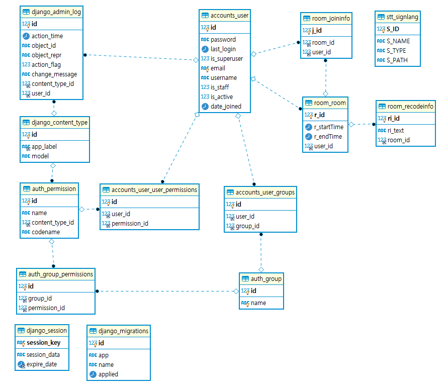
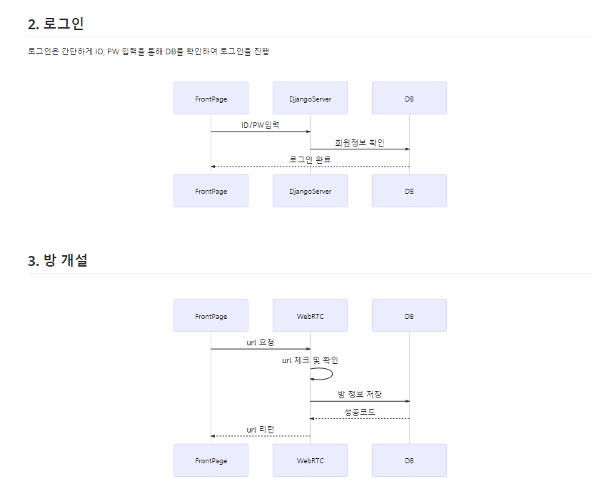
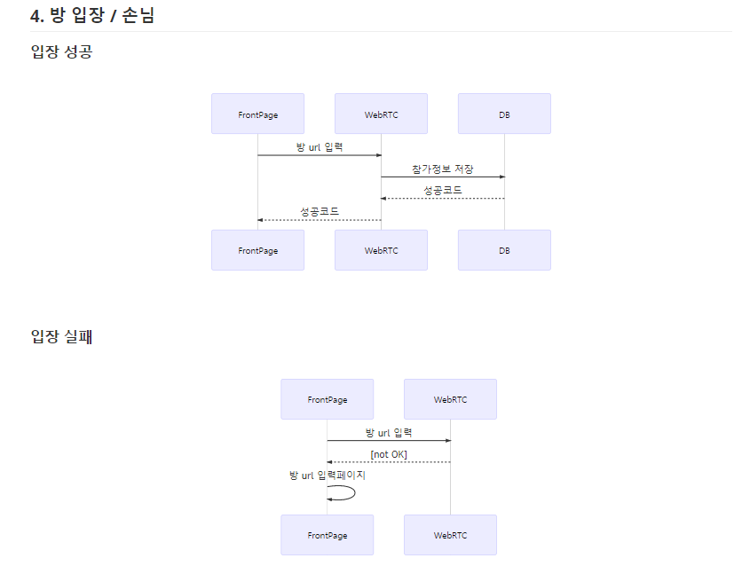

<p align="center">
  
</p>

# VODA(보다 : 보다 더, 넓은 세상을 보다)

> 청각장애인도 사용 할 수 있는 화상미팅서비스

## 목차

- [VODA(보다 : 보다 더, 넓은 세상을 보다)](#voda보다--보다-더-넓은-세상을-보다)
  - [목차](#목차)
  - [:paperclip: 개요](#paperclip-개요)
    - [시연 영상](#시연-영상)
    - [향후 전망](#향후-전망)
  - [:clipboard: 기능](#clipboard-기능)
    - [ERD](#erd)
    - [와이어 프레임](#와이어-프레임)
  - [:gear: 기술 스택](#gear-기술-스택)
  - [:hammer_and_pick: 기술 설명](#hammer_and_pick-기술-설명)
    - [디렉토리 구조도](#디렉토리-구조도)
    - [시퀀스 다이어그램](#시퀀스-다이어그램)
    - [실행방법](#실행방법)
  - [기타](#기타)
    - [참고](#참고)
    - [Samsung Software Academy for Youth 2th Gumi, 특화프로젝트 D206](#samsung-software-academy-for-youth-2th-gumi-특화프로젝트-d206)
    - [영상출처](#영상출처)
  - [테스트 방법](#테스트-방법)

## :paperclip: 개요

> 일반 화상미팅 서비스를 청각 장애가 있는 사용자는 사용하기가 힘듭니다. 실시간 자막 서비스와 수어서비스를 제공함으로써, 장애가 있는 사람도 사용 할 수 있는 서비스를 제공합니다.

### 시연 영상

### 향후 전망

> 지화 인식시 타임시퀀스 개선 <br>
> 수어 데이터 부족으로 인한 모든 말을 영상제공 어려움<br>
> 동음이의어 구분과 지화만이 아닌 수어 인식

## :clipboard: 기능

### ERD



### 와이어 프레임

[와이어프레임 링크](산출물/와이어프레임.pdf)


## :gear: 기술 스택

| 개발 언어 | 개발 환경 |     API & 라이브러리     |
| :-------: | :-------: | :----------------------: |
|  Python   |  Django   |          WebRTC          |
|    JS     |  Vue.js   |        TensorFlow        |
|           |  Node.js  |          OpenCV          |
|           |  MariaDB  | Google STT(음성 -> Text) |
|           |           |      KSS(문장 분리)      |
|           |           |       TF handpose        |

## :hammer_and_pick: 기술 설명

### 디렉토리 구조도

```
VODA
  └───VODARTC               : 화상 미팅 서비스(WEBRTC)
  │     └───hand            : tensorflow handpose를 이용한 지화 인식
  │     └───voda
  │       └───create        : 로그인 유저 방생성 및 방참가 페이지
  │       └───join          : 비로그인 유저 방참가 페이지
  │
  └───backend               : Django Rest Server
  │     └───account         : 회원가입, 정보, 로그인
  │     └───backend         : Django 설정
  │     └───hand            : tensorflow 사용하여 손 뼈대 이미지 분석
  │     └───room            : 방생성 정보, 회의록 기록, 참가기록
  │     └───stt             : 텍스트 데이터 문장분석, 형태소 분석, 후 수어 영상 경로 리턴
  │
  └───doc                   : readme에 필요한 자료 모음
  │
  └───front                 : vue.js
  │     └───src
  │       └───views         : 메인화면, 로그인, 회원가입, 손님
  │       └───components    : 헤더
  │       └───router        : url 관리
  │
  └───산출물                : 산출물

```

### 시퀀스 다이어그램

[시퀀스다이어그램 링크](산출물/시퀀스다이어그램.md)





### 실행방법

1.  Clone the repo

```sh
git clone https://lab.ssafy.com/s03-ai-sub3/s03p23d206
cd s03p23d206
```

2. FRONT

```sh
  cd /front
  npm i
  npm run serve
```

3. BACKEND

```sh
##가상환경 만들기
python -m venv venv

##가상환경 실행
##window
source venv/Scripts/activate
##ubuntu
source venv/bin/activate

##pip upgrade
python -m pip install --upgrade pip

## requirements 설치
pip install -r requirements.txt
pip install kss
pip install konlpy
pip install tensorflow
pip install opencv-python
pip install pillow

cd backend

python manage.py runserver
```

4. VODARTC

```sh
cd /VODARTC

npm i
yarn

cd hand
yarn build

cd ..
node server.js
```

## 기타

### 참고

- [Tensorlfow hand Pose](https://github.com/tensorflow/tfjs-models/tree/master/handpose)
- [RTCMultiConnection](https://github.com/muaz-khan/RTCMultiConnection)
- [KoNLPy(형태소분석)/stt(문장분리) 환경설정](https://www.notion.so/KoNLPy-stt-dbf82c14c3114082a378366f131dfc3f)
- [젠킨스설치](https://www.notion.so/Jenskins-44b1c015e3894ac6b40bffef554c9bef)
- [Ubuntu Python Version Update](https://www.notion.so/ubuntu-python-version-update-a9748362a8454661a28643e27a649dfa)

### [Samsung Software Academy for Youth](https://www.ssafy.com/) 2th Gumi, 특화프로젝트 D206

- `김영민[BackEnd,WebRtc]` - kastori1990@gmail.com<br>
- `이예림[BackEnd,FrontEnd]` - yearim.lee15b@gmail.com<br>
- `임효진[WebRTC,NLP]` - hyojinlim38@gmail.com<br>
- `윤신혜[AI(딥러닝),NLP]` - shyoon622@gmail.com<br>
- `지민우[AI(데이터전처리),NLP]` - mm950406@naver.com<br>

### 영상출처

- [한국수어사전](http://sldict.korean.go.kr/front/main/main.do)

## 테스트 방법

```
https://j3d206.p.ssafy.io/
email : test@test.com
password : test
```
