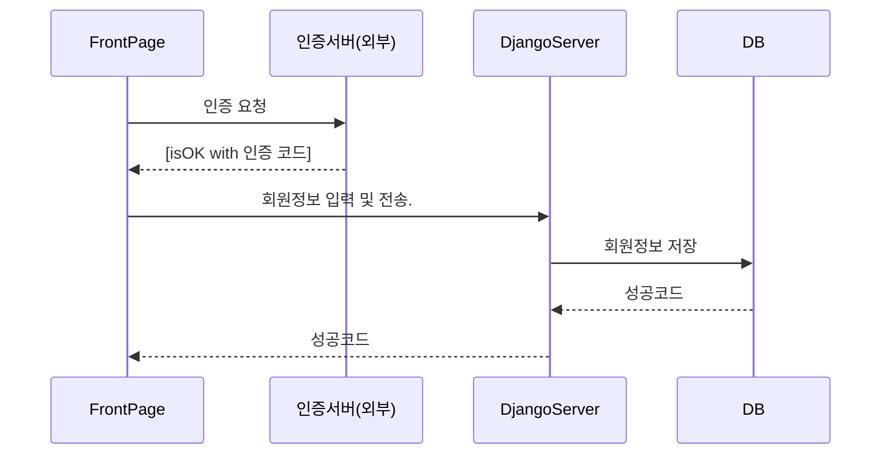
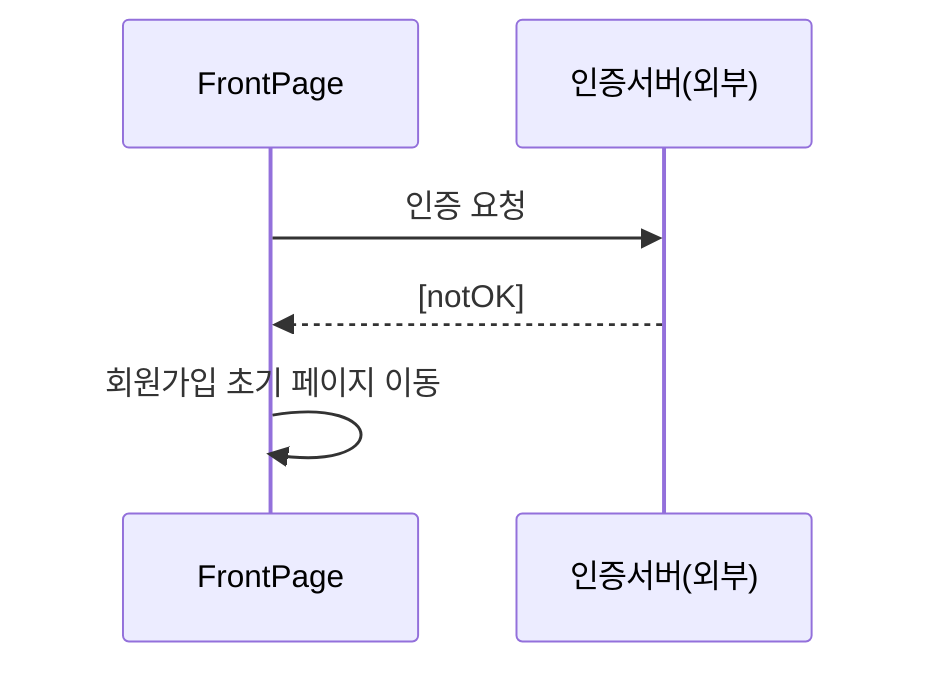
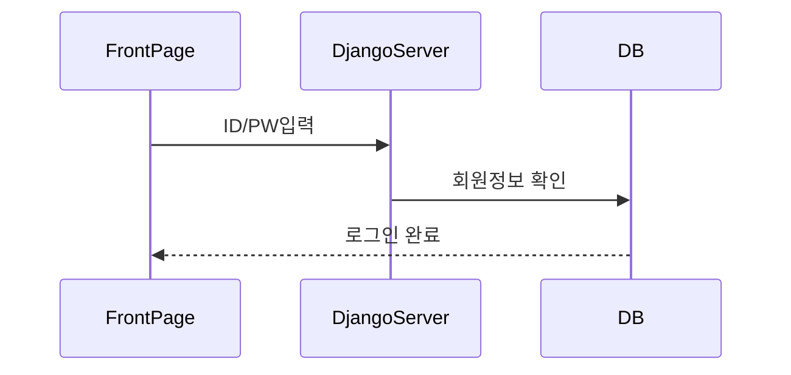
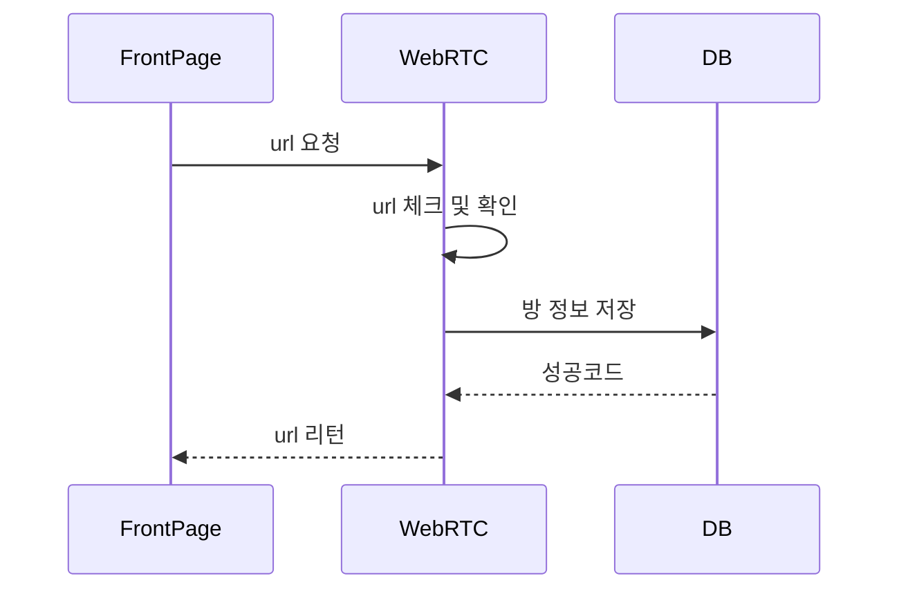
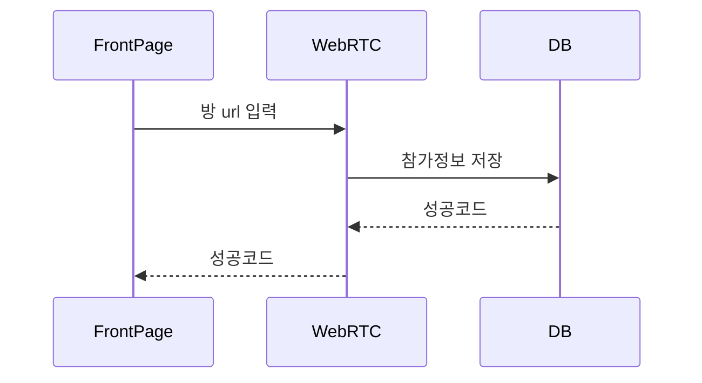
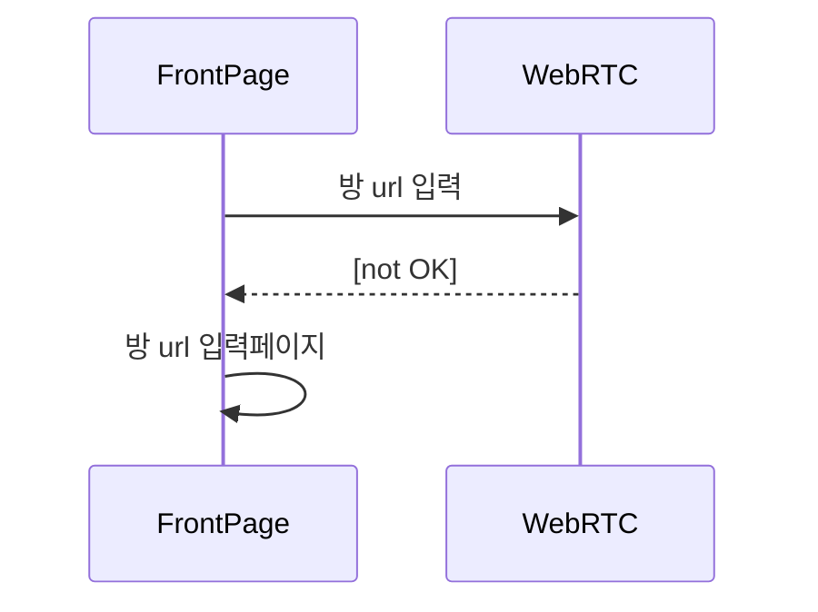
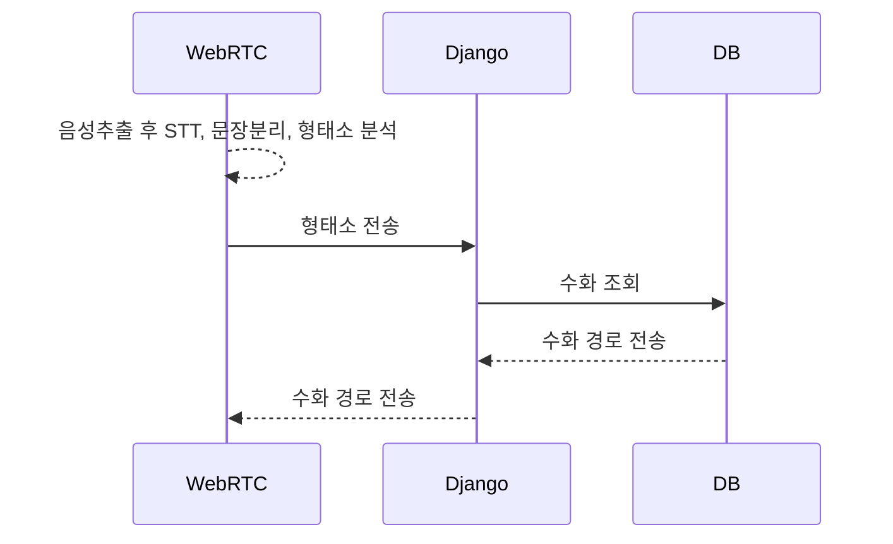
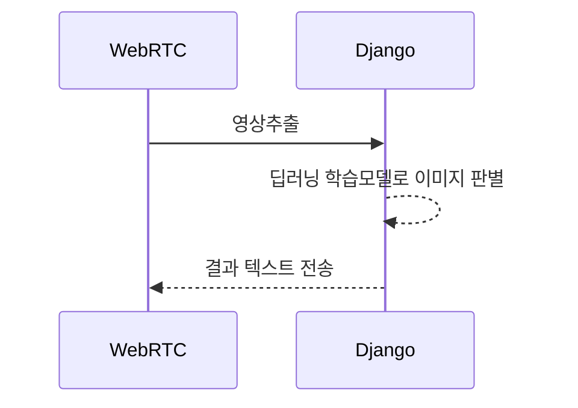

# VODA 

## 1. 회원 가입

실명 인증은 별도의 실명 인증 서버를 거쳐 OK를 받으면 저장한다. 

#### 인증 성공의 경우

#### 인증 실패의 경우

## 2. 로그인

로그인은 간단하게 ID, PW 입력을 통해 DB를 확인하여 로그인을 진행

## 3. 방 개설

## 4. 방 입장 / 손님

### 입장 성공

### 입장 실패

## 5. 음성 -> 수화 / 수화-> 음성

### 음성 -> 수화

### 수화 -> 텍스트

